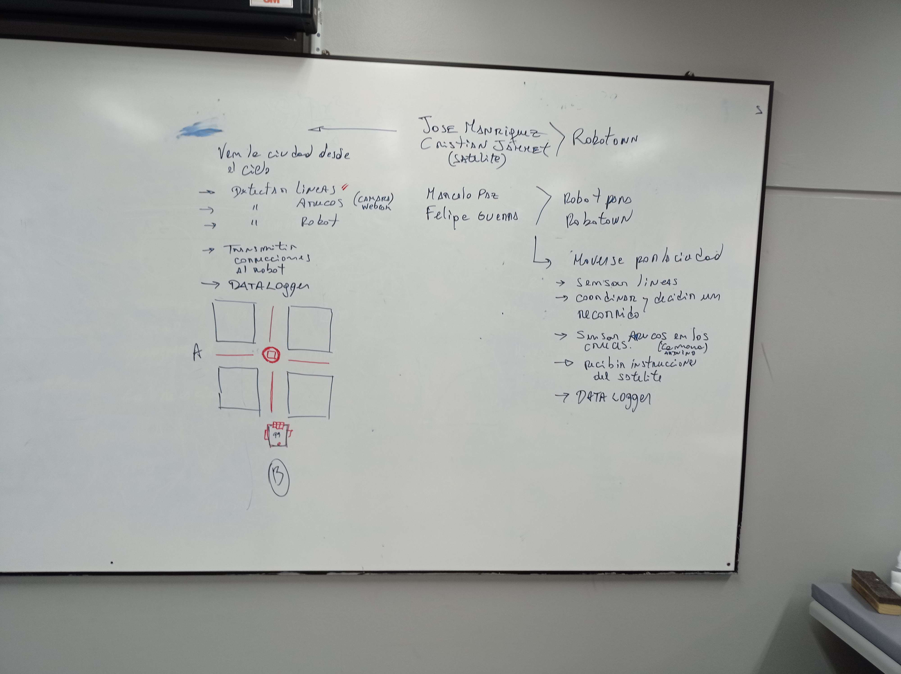
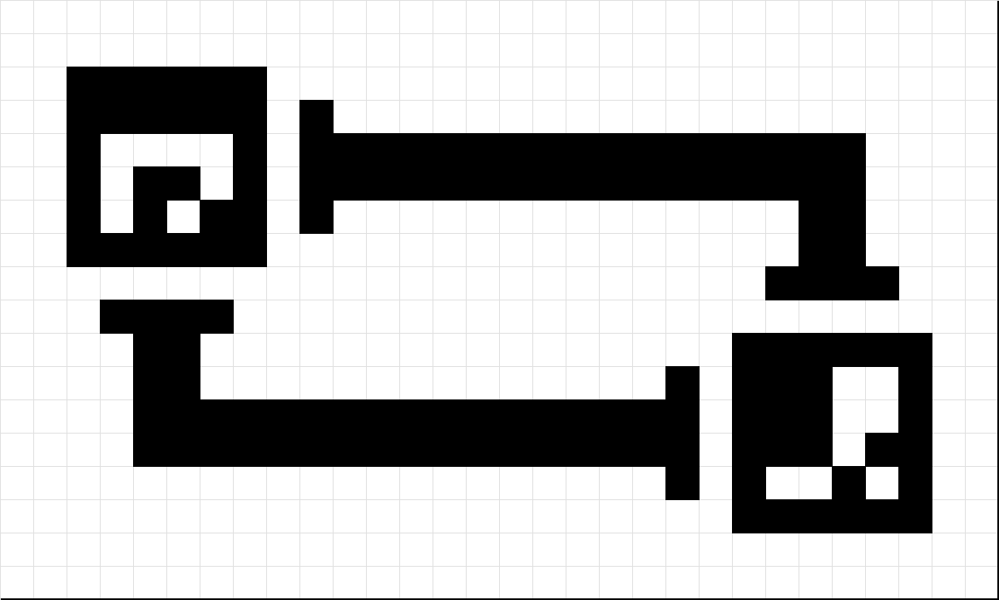

# Robot para RoboTown

Objetivos Generales:

- [X] Moverse por la ciudad
- [ ] Sensar lineas
- [X] Coordinar y decidir un recorrido
- [ ] Sensar ArUcos en los cruces (camara)
- [X] Recibir instrucciones del satelite(Jose y Jammet)
- [ ] Datalogger

Objetivos Especificos:

- [X] Armar un robot tipo auto, utilizando un ESP32 (Wemos d1 r32), 3 sensores de linea, 1 camara, 2 servos, una rueda loca y un datalogger. (El robot deberia tener un aruco 99)
- [X] Luego para poder crear el software, sera necesario documentar bien la compatibilidad de los sensores y sus librerias.
  - [X] Plantilla informe (En proceso)
  - [X] Documentar datasheet
- [X] Codigo que controle los servomotores.
- [ ] Codigo que controle los sensores de linea.
- [ ] Codigo que controle una camara Arduino. (Felipe [Abandono])
- [X] Codigo que procese imagen para reconocer Arucos. (Jose y Jammet)
- [X] Codigo que procese una ruta.
- [ ] Codigo que guarde los datos en el datalogger [No se agrego porque no habia información para agregar].
- [X] Codigo que comunique con el satelite.. (Jose y Jammet)
- [X] Controlar ciertos datos utilizando una interfaz grafica en python de forma local.

## Ideas

- Se utilizan ArUcos de 4x4.
- Se supone que el robot utilizara los sensores 4 y 5 en todo momento, para seguir la linea.
- Se supone que se utilizara los sensores 3, 4, 5 y 6 para detectar los cruces y disminuir la velocidad para utilizar el codigo que detecta el aruco.
  - Los datos a ingresar seran con los sensores 4 al 6, ademas de utilizar 3 y 7 se definira los bordes del aruco.

### Medidas

- Supongamos que cada cuadrado tiene un tamaño de 7,925 mm
- Por lo tanto cada ArUco sera de unos 47,55 x 47,55 mm
- Las lineas deberian ser de 15,85 mm de ancho (2 cuadrados)
